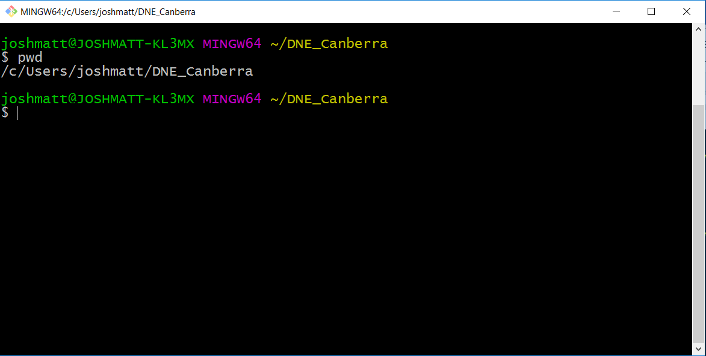
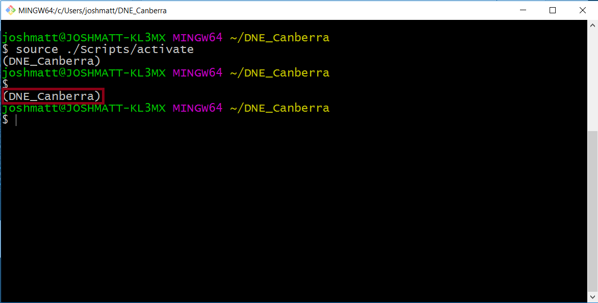
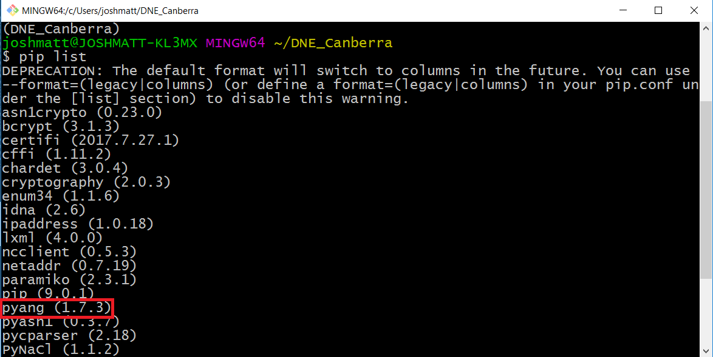
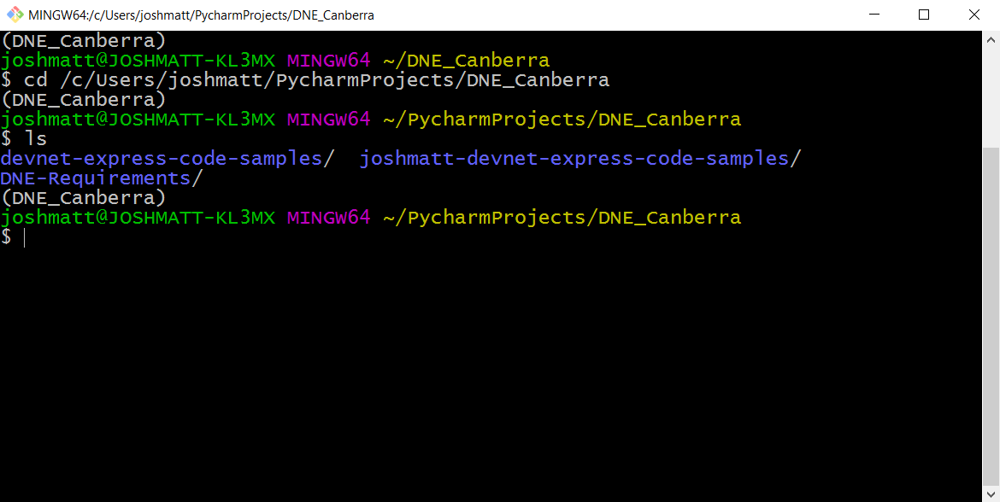
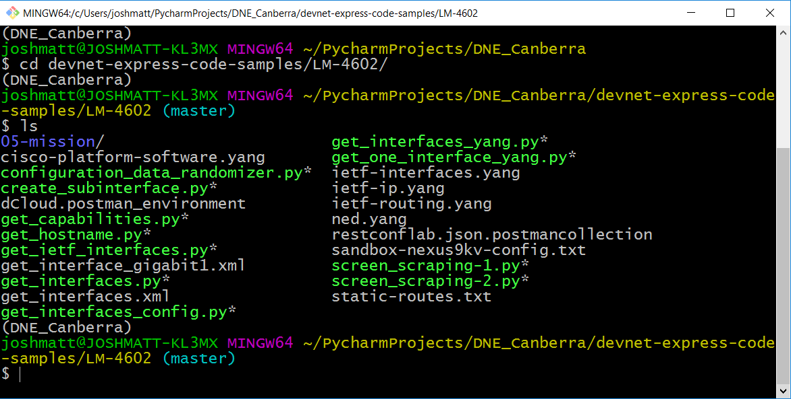
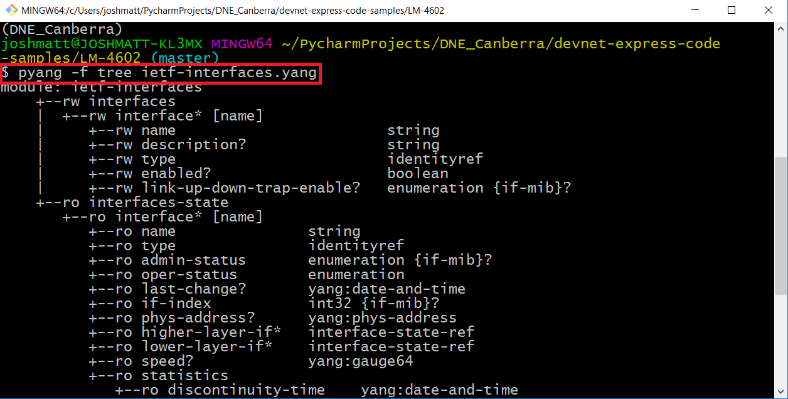

# pyang-for-windows
Running Pyang requires a Bash shell, unless the Windows 10 Creators update is installed - a Bash shell is not installed by default in Windows.
Two fairly simple alternatives exist - Cygwin and Git Bash.
This guide will cover how to run Pyang from a Git Bash.

### 1. Open Git Bash and Activate Virtual Environment
Search for and open the Git Bash from the start menu.

If you are using a Python Virtal Environment, change directory to the path in which you have created your virtual environment.

To activate the virtual environment, from this directory run `source Scripts/activate`

You should now notice the name of your virual environment appear directly above the Git Bash prompt in parenthesis - in my case this was `(DNE_Canberra)`

### 2. Verify and Run Pyang

Confirm that the `pyang` Python package is installed within your virtual environment by running `pip list` from the Git Bash.

If `pyang` was missing, you can install `pyang` by running the command `pip install pyang` from the Git Bash.

Change directory to your project directory.

The DevNet Express Netconf/YANG lab example code is found in `devnet-express-code-samples/LM-4602` - change to this directory.

Confirm you can now run `Pyang` from the Git Bash shell by running `pyang -f tree ietf-interfaces.yang`.

